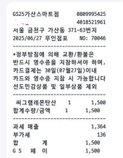

# GS DX LAB 무인 편의점 방문기 – 디지털 결제 시스템 체험

최근 스터디를 함께하는 지인과 함께 무인·자동화 편의점을 방문할 기회가 있었다. 이 지인은 과거 편의점 자동화 관련 인턴 경험이 있어, 근처에 관련 시스템이 도입된 GS DX LAB이라는 무인 편의점에 함께 방문하게 되었다.

## 입장부터 눈에 띈 무인 시스템

편의점에 도착하였을 때 가장 먼저 눈에 들어온 것은 점원이 존재하지 않는다는 점이었다. 그 대신 지하철 개찰구와 유사한 구조의 입구 및 출구 게이트가 설치되어 있었고, 입구 안내문에는 다음과 같은 내용이 적혀 있었다.

> “입장 전 GS 편의점 전용 앱에 결제 수단을 등록하고, 앱 내 QR 코드를 찍으면 입장이 가능합니다. 이후 물건을 들고 바로 나오면 자동으로 결제가 완료됩니다.”

안내에 따라 애플리케이션을 설치하고 결제 수단을 등록한 후, QR 코드를 스캔하여 입장하였다.

## 면적 대비 CCTV 밀집도가 매우 높음

편의점 내부에 들어서자마자 천장에 설치된 다수의 CCTV 카메라가 눈에 띄었다. 지금까지 방문한 공간 중 가장 높은 면적당 CCTV 설치 밀도를 보유한 장소였다.

지인의 설명에 따르면, 매대 아래에 설치된 깔판 형태의 장치는 저울로 추정되었다. 지인이 과거 인턴을 했던 기업과는 다른 시스템이었으나, 이 저울과 CCTV를 함께 활용하여 고객의 위치와 손에 든 상품을 실시간으로 인식하는 구조로 보인다고 하였다.

## ‘물건을 들고 그냥 나간다’는 경험

직접 탄산수 한 병을 집어 들고 출구로 향하였다. 입장 시와 달리 출구 게이트는 별도의 QR 인증 없이 자동으로 열렸고, 출구를 통과한 지 약 10초 후 결제 완료 메시지가 도착하였다.

이 과정에서 다소 이질적인 감정이 들었다. 일반적으로는 키오스크나 점원을 통해 결제라는 과정을 직접 수행한 후 물건을 소지하고 나오는 것이 익숙한데, 본 시스템에서는 해당 절차 없이 ‘그냥 들고 나오는’ 형태였기에 일종의 도둑질을 하는 듯한 느낌이 들기도 하였다.

### 불편함의 정체는 확인 과정의 부재?

이러한 불편함은 단지 익숙하지 않아서 생긴 감정일 수도 있으나, 동시에 우리가 일상적으로 수행해 온 ‘물건을 스캔하고 결제하는’ 행위 자체가 구매에 대한 확신을 얻기 위한 확인 절차였다는 점이라는 것도 생각했다. 즉, 자신이 선택한 물건이 맞는지, 결제가 올바르게 이루어졌는지를 무의식적으로 점검하던 과정이 생략되었기에 불안감이 생긴 것이다.

이번 방문을 통해 든 생각은, 트래킹 기반 디지털 결제 시스템이 완전 무인형으로 정착되기보다는, 사용자가 불확실성을 줄이기 위한 시각적·물리적 확인 단계를 일부 포함하는 형태로 발전해 나갈 가능성이 높다고 예측한다. 사용자에게는 여전히 ‘확인’의 순간이 필요하기 때문이다.
